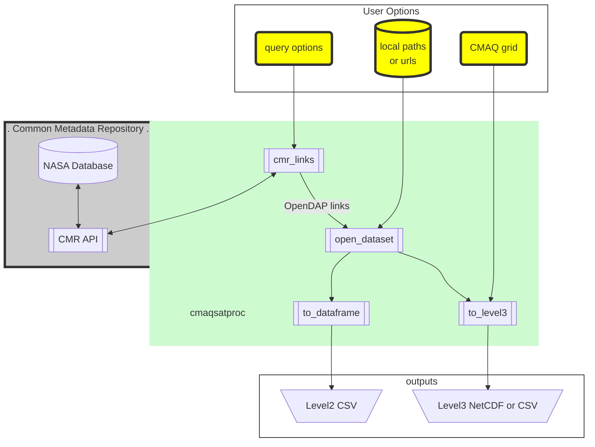

# cmaqsatproc

Satellite Processors designed for simple CMAQ comparisons.

## What can you do?

* convert L2 or L3 satellite products to L3 on CMAQ grids
  * 2-d species like total or tropospheric columns
  * n-d vairables like averaging kernels and scattering weights.
* convert CMAQ concentrations to L3-like products
  * Apply satellite averaging kernels to CMAQ concentrations to make satellite-like CMAQ
  * Apply CMAQ to create alternative air mass factors to make CMAQ-like satellite products.

## What makes it simple?

`cmaqsatproc` has an easy full suite approach

1. Operates on local files or dynamically finds remote files
  1. User can specify input files from their disk.
  2. Queries NASA's Common Metadata Repository (CMR) or NOAA AWS
2. Allows for spatial subsetting based on a simple box.
  1. User can specify the box based on lat/lon
  2. The CMAQ grid can be used to automatically define the box.
3. Provides L2 access as a dataframe or makes Level 3 data as a dataset
4. [Simple instructions](COLABINSTALL.md) are provided to configure Google Colab.

## Short Example

### OMI NO2 Satellite -- OpenDAP to CMAQ-Grid

This example requires OpenDAP access configured on the machine, but does not
require any local files (satellite or CMAQ).

```
import cmaqsatproc as csp

GDNAM = '12US1'
date='2019-07-24'
readername = 'TropOMINO2' # or TropOMIHCHO, VIIRS_AERDB, ...
outpath = f'{readername}_{date}_{GDNAM}.nc'

cg = csp.open_griddesc(GDNAM)
satreader = csp.reader_dict[readername]

l3 = satreader.cmr_to_level3(
    temporal=f'{date}T00:00:00Z/{date}T23:59:59Z',
    bbox=cg.csp.bbox(), grid=cg.csp.geodf, verbose=9
)
l3.to_netcdf(outpath)
```

### SNPP VIIRS Deep Blue -- Downloaded files to CMAQ-Grid

This example assumes you have downloaded satellite files. The code is largely
the same as the previous. Instead of `cmr_to_level3`, it the method uses `glob`
to make a list of files that it passes to `paths_to_level3`.

```
from glob import glob
import cmaqsatproc as csp

GDNAM = '12US1'
date='2019-07-24'
readername = 'VIIRS_AERDB' # or TropOMIHCHO, VIIRS_AERDB, ...
outpath = f'{readername}_{date}_{GDNAM}.nc'

cg = csp.open_griddesc(GDNAM)
satreader = csp.reader_dict[readername]

paths = sorted(glob('AERDB_L2_VIIRS_SNPP*.nc'))
l3 = satreader.paths_to_level3(
    paths, bbox=cg.csp.bbox(), grid=cg.csp.geodf, verbose=9
)
l3.to_netcdf(outpath)
```

### CMAQ NO2 to OMI

This example requires an output from one of the previous exmaples. The data
from the level3 satellite output is combined with CMAQ to make a comparison.

```
import cmaqsatproc as csp
import xarray as xr

GDNAM = '12US1'
date='2019-07-24'
readername = 'TropOMINO2'

satreader = csp.reader_dict[readername]
l3 = xr.open_dataset(f'{readername}_{date}_{GDNAM}.nc')

qf = csp.open_ioapi(f'CCTM_CONC_{date}_{GDNAM}.nc')[['NO2']]
mf = csp.open_ioapi(f'METCRO3D_{date}_{GDNAM}.nc')
qf['DENS'] = mf['DENS']
qf['ZF'] = mf['ZF']
qf['PRES'] = mf['PRES']
# Create satellite according to CMAQ, and CMAQ according to satellite
overf = satreader.cmaq_process(qf, l3)
overf.to_netcdf(f'{readername}_{date}_{GDNAM}_CMAQ.nc')
```

## What assumptions are being made?

* Spatial matching is pretty good
  * For satellite products with pixel corners, fractional area weighting is used by default. Other options are avilable.
* Satellite AveragingKernels are averaged
  * within a single day or overpass depending on configuration.
  * within grid cells.
* CMAQ stratosphere is using one of several methods
  * Removed according to the satellite averaging kernel.

## Prerequisites

* numpy
* xarray
* netcdf4
* pyproj
* pandas
* geopandas
* h5netcdf is required for s3 support

## OpenDAP Support

OpenDAP is supported through standard NetCDF-C support. If authentication is
required, configure `.netrc` and `.dodsrc`. The configuration is described
several places. Although urls tend to update, the links below are currently useful:

* https://disc.gsfc.nasa.gov/data-access
* https://docs.unidata.ucar.edu/netcdf-c/current/auth.html
* https://docs.opendap.org/index.php/DAP_Clients_-_Authentication

To summarize those resources, make a user-access-only `.netrc` file. Then, make
a `.dodsrc` file that points to the `.netrc` file and a `.urs_cookies` file.
The commands below achieve this goal, but will overwrite anything you already
have there:

```bash
touch ~/.netrc
touch ~/.urs_cookies
chmod 0600 ~/.netrc
cat << EOF > ~/.dodsrc
HTTP.NETRC=${HOME}/.netrc
HTTP.COOKIEJAR=${HOME}/.urs_cookies
EOF
# where <uid> and <password> are your Earthdata credentials
cat << EOF >> ~/.netrc
machine urs.earthdata.nasa.gov
  login <uid>
  password <password>
EOF
```

Notes:
1. I have only been able to make this work if the files are in the user home directory.
2. netcdf4-python version 1.6 has trouble with opendap.


## Diagram



## References

Henderson, B. H. (2022, October 17). cmaqsatproc v2: Satellite data processing for CMAQ [Poster]. 21st Annual Community Modeling and Analysis System Conference, Chapel Hill, NC. https://www.cmascenter.org/conference/2022/agenda.cfm; [direct link](https://www.cmascenter.org/conference/2022/slides/Henderson_satellite-data-CMAS2022.pdf)
