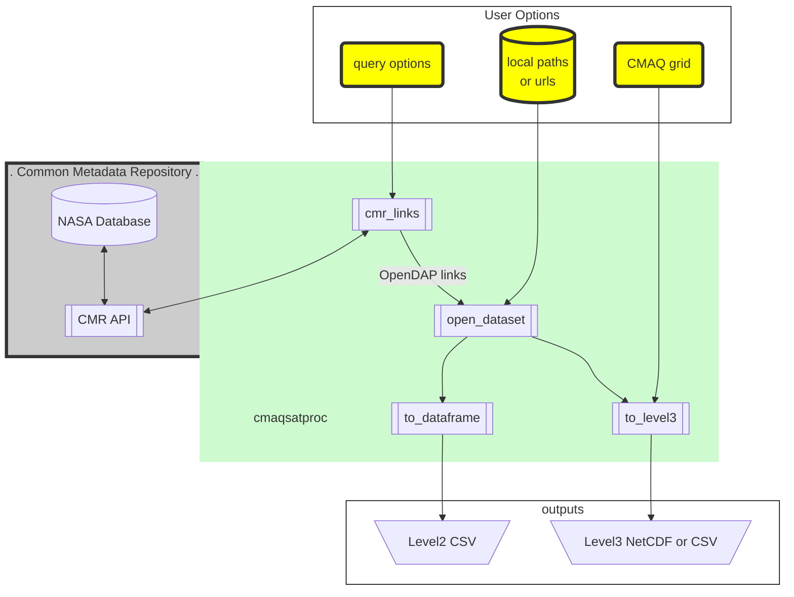

# cmaqsatproc

Satellite Processors designed for simple CMAQ comparisons.

## What can you do?

* convert L2 or L3 satellite products to L3 on CMAQ grids
  * 2-d species like total or tropospheric columns
  * n-d vairables like averaging kernels and scattering weights.
* convert CMAQ concentrations to L3-like products
  * apply satellite averaging kernels to CMAQ concentrations
  * create alternative air mass factors

## What makes it simple?

`cmaqsatproc` has an easy full suite approach

1. Operates on local files or dynamically finds remote files
  1. User can specify input files from their disk.
  2. Queries NASA's Common Metadata Repository (CMR)
2. Allows for spatial subsetting based on a simple box.
  1. User can specify the box based on lat/lon
  2. The CMAQ grid can be used to automatically define the box.
3. Provides L2 access as a dataframe or makes Level 3 data

## Short Example

### OMI NO2 Satellite -- OpenDAP to CMAQ-Grid

This example requires OpenDAP access configured on the machine, but does not
require any local files (satellite or CMAQ).

```
import cmaqsatproc as csp

GDNAM = '108NHEMI2'
readername = 'OMNO2'
date='2018-07-01'
outpath = f'{readername}_{date}_{GDNAM}.nc'

cg = csp.cmaq.CMAQGrid(GDNAM)
satreader = csp.readers.reader_dict[readername]

outputs = satreader.cmr_to_level3(
    temporal=f'{date}T00:00:00Z/{date}T23:59:59Z', bbox=cg.bbox()
)
outputs.to_netcdf(outpath)
```

### OMI NO2 Satellite -- Downloaded files to CMAQ-Grid

This example assumes you ahve downloaded satellite files. The code is largely
the same as the previous. Instead of `cmr_to_level3`, it the method uses `glob`
to make a list of files that it passes to `paths_to_level3`.

```
import cmaqsatproc as csp
from glob import glob

GDNAM = '108NHEMI2'
readername = 'OMNO2'
date='2018-07-01'
outpath = f'{readername}_{date}_{GDNAM}.nc'

paths = sorted(glob(f'/local/path/to/*{date}*.h5'))
outputs = satreader.paths_to_level3(
    temporal=f'{date}T00:00:00Z/{date}T23:59:59Z', bbox=cg.bbox()
)
outputs.to_netcdf(outpath)
```

### CMAQ NO2 to OMI

This example requires an output from one of the previous exmaples. The data
from the level3 satellite output is combined with CMAQ to make a comparison.

```
import cmaqsatproc as csp
import xarray as xr


GDNAM = '108NHEMI2'
readername = 'OMNO2'
date='2018-07-01'
satpath = f'{readername}_{date}_{GDNAM}.nc'
cmaqsatpath = f'{readername}_{date}_{GDNAM}_CMAQ.nc'

cg = csp.cmaq.CMAQGrid(GDNAM)
satreader = csp.readers.reader_dict[readername]

satf = xr.open_dataset(satpath)

qf = cmaqsatproc.cmaq.open_ioapi('CCTM_CONC_{date}.nc')
mf = cmaqsatproc.cmaq.open_ioapi('METCRO3D_{date}.nc')
qf['DENS'] = mf['DENS']
qf['ZF'] = mf['ZF']
qf['PRES'] = mf['PRES']

# OMI is on the aura satellite, so we create an average overpass
# file using approximate Aura overpass times
# Calculate Partial Columns for one or many species
overf = cg.mean_overpass(qf, satellite='aura')
n_per_m2 = cg.mole_per_m2(overf, add=True)
overf['NO2_PER_M2'] = n_per_m2 * overf['NO2'] / 1e6
amf = overf['AmfTropCMAQ'] = satreader.cmaq_amf(overf, outputs)
ak = overf['CMAQ_AK'] = satreader.cmaq_ak(overf, outputs)
overf['VCDNO2_CMAQ'] = overf['NO2_PER_M2'].where(~ak.isnull()).sum('LAY').where(~amf.isnull())
overf['VCDNO2_OMI_CMAQ'] = (
    outputs['ColumnAmountNO2Trop'] * outputs['AmfTrop'] / overf['AmfTropCMAQ']
)
overf.to_netcdf(cmaqsatpath)
```

## What assumptions are being made?

* Spatial matching is pretty good
  * For satellite products with pixel corners, fractional area weighting is used.
  * For satellite products like MODIS, satellite pixel centers are matched to CMAQ projected grids. No attempt to apply area-fractions is made.
* Satellite AveragingKernels are averaged
  * within a single day
  * within grid cells
* CMAQ stratosphere is using one of several methods
  * Removed according to potential vorticity.
  * Removed according to the WMO definition.
  * Removed according to the satellite averaging kernel.

## How to?

An example notebook and python script is provided in the examples folder.

* ./examples/basic.ipynb
* ./examples/opendap_l3_example.py
* ./examples/opendap_csv_example.py

## Prerequisites

* numpy
* xarray
* pyproj
* pandas
* geopandas
* PseudoNetCDF (http://github.com/barronh/PseudoNetCDF) and associated prereqs

## OpenDAP Support

OpenDAP is supported through standard NetCDF-C support. If authentication is
required, configure `.netrc` and `.dodsrc`. The configuration is described
several places. Although urls tend to update, the links below are currently useful:

* https://disc.gsfc.nasa.gov/data-access
* https://docs.unidata.ucar.edu/netcdf-c/current/auth.html
* https://docs.opendap.org/index.php/DAP_Clients_-_Authentication

To summarize those resources, make a user-access-only `.netrc` file. Then, make
a `.dodsrc` file that points to the `.netrc` file and a `.urs_cookies` file:

```bash
touch ~/.netrc
chmod 0600 ~/.netrc
# where <uid> and <password> are your Earthdata credentials
cat << EOF >> ~/.netrc
machine urs.earthdata.nasa.gov
  login <uid>
  password <password>
EOF

cat << EOF >> ~.dodsrc
HTTP.NETRC=${HOME}/.netrc
HTTP.COOKIEJAR=${HOME}/.urs_cookies
EOF
```

Note: I have only been able to make this work if the files are in the user home directory.
## Diagram


